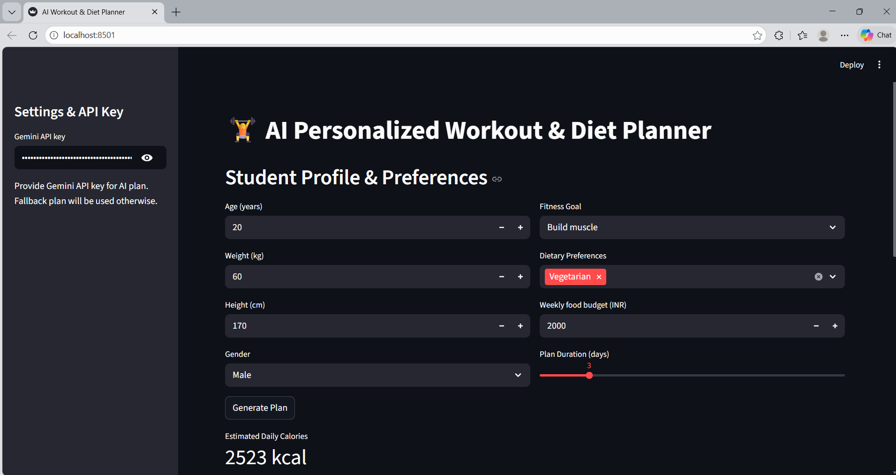
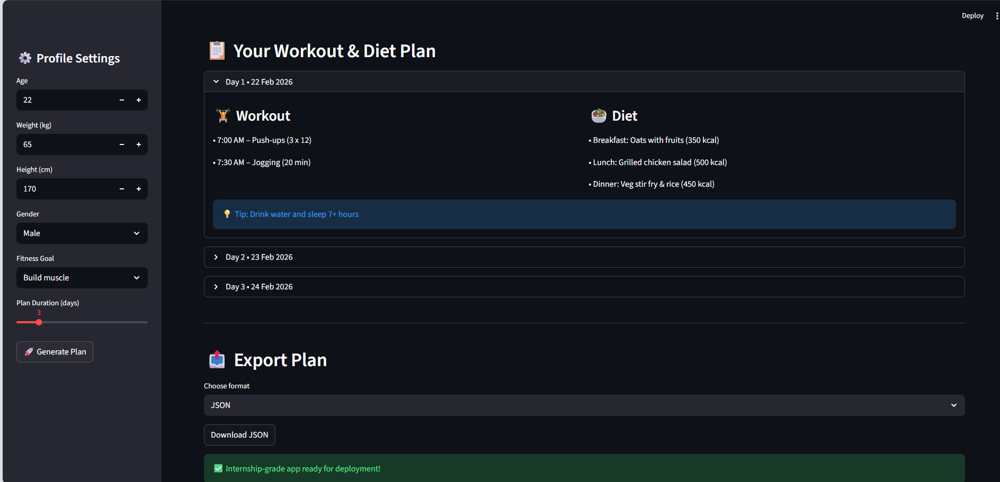

# 🏋️‍♂️ AI-Powered Personalized Workout & Diet Planner

An **AI-driven fitness application** that generates **personalized workout routines and diet plans** based on user inputs.  
Built as part of the **AICTE – IBM SkillsBuild Internship on AI & Cloud Technologies**.

---

## 📌 Project Overview

The **Personalized Workout & Diet Planner** uses Artificial Intelligence to recommend:
- Customized workout plans
- Diet suggestions based on fitness goals
- Downloadable fitness reports

The application is designed with a **simple UI** and focuses on **real-world usability**, helping users maintain a healthy lifestyle using AI-based recommendations.

---

## 🚀 Features

- 🧠 AI-based personalized workout recommendations  
- 🥗 Diet plan generation based on user goals  
- 📄 PDF report generation for workouts & diet plans  
- 💻 Interactive and easy-to-use interface  
- ⚡ Lightweight and fast execution  

---

## 🛠️ Tech Stack

- **Programming Language:** Python  
- **Framework:** Streamlit  
- **Libraries Used:**  
  - pandas  
  - numpy  
  - fpdf  
  - streamlit  
- **Tools:** Git, GitHub  

---

## 📂 Project Structure
Personalized-Workout-Diet-Planner-with-AI-internship-project-1
│
├── app.py # Main Streamlit application
├── requirements.txt # Required Python dependencies
├── screenshots/ # Application screenshots
│ ├── 1.png
│ └── 2.png
└── README.md # Project documentation


---

## 🖼️ Screenshots

### 🔹 Application Interface


### 🔹 Generated Workout & Diet Plan


---

## ⚙️ Installation & Setup

Follow these steps to run the project locally:

### 1️⃣ Clone the Repository
```bash
git clone https://github.com/PRANAYKHOJARE/Personalized-Workout-Diet-Planner-with-AI-internship-project-1.git
cd Personalized-Workout-Diet-Planner-with-AI-internship-project-1

pip install -r requirements.txt

streamlit run app.py

This project was developed as part of the
AICTE – IBM SkillsBuild 4-Weeks Internship on AI & Cloud Technologies, implemented by Edunet Foundation.

Duration: September 2025 – October 2025

Focus Areas: Artificial Intelligence, Cloud Fundamentals, Project-Based Learning

👨‍💻 Author

Pranay Khojare
Entry-Level Software Engineer | Java | React.js | Azure | AI & Cloud
🔗 GitHub: https://github.com/PRANAYKHOJARE

🔗 LinkedIn: https://www.linkedin.com/in/pranay-khojare-a23505211/

⭐ Acknowledgements

AICTE

IBM SkillsBuild

Edunet Foundation
